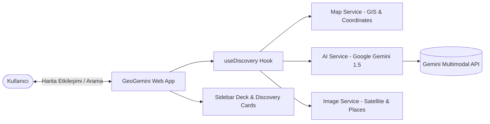

# 🌍 GeoGemini - AI-Powered Geospatial Intelligence & Discovery Platform

[](https://www.typescriptlang.org/)
[](https://reactjs.org/)
[](https://vitejs.dev/)
[](https://tailwindcss.com/)
[](https://deepmind.google/technologies/gemini/)
[](https://www.yucelgumus.dev/)

> **Google Gemini 1.5 Multimodal AI** modelleri ile interaktif coğrafi bilgi sistemlerini (GIS) buluşturan; dünya üzerindeki konumları, tarihi mekanları ve coğrafi rotaları anlık olarak keşfedip akıllı analizler sunan yeni nesil harita ve mekansal zeka uygulaması.

---

## 🌟 Öne Çıkan Özellikler

- 📍 **Yapay Zeka Destekli Konum Keşfi (AI Discovery):** Harita üzerinde işaretlenen veya aranan herhangi bir nokta hakkında Gemini 1.5 Pro / Flash ile derinlemesine tarihi, kültürel ve coğrafi analizler üretir.
- 🗺️ **İnteraktif Çok Katmanlı Harita Deneyimi:** Akıcı yakınlaştırma, pan kontrolleri, özel harita işaretçileri (custom markers) ve dinamik katman geçişleri.
- 🖼️ **Görsel & Uydu Zekası (Multimodal Visuals):** Seçilen koordinatlar ve yapılar için yüksek kaliteli fotoğraflar, uydu görselleri ve anlamsal görsel betimlemeleri.
- 🗂️ **Sidebar Deck & Detay Kartları:** Keşfedilen yerlerin özetlerini, ilgi çekici noktalarını (POI) ve ipuçlarını organize bir şekilde sunan şık yan panel arayüzü.
- ⚡ **Vite & React 18 ile Ultra Hızlı Performans:** Modern React hook mimarisi (`useDiscovery`) ve Tailwind CSS ile kusursuz responsive tasarım.

---

## 🏗️ Mimari & Teknoloji Yığını



| Kategori | Teknoloji / Kütüphane | Açıklama |
| :--- | :--- | :--- |
| **Frontend Framework** | React 18 + TypeScript | Tip güvenli reaktif bileşen mimarisi |
| **Build & Tooling** | Vite 5 | Hızlı HMR ve optimize edilmiş web derlemesi |
| **Styling** | Tailwind CSS + PostCSS | Modern, temiz ve tam duyarlı (responsive) tasarım |
| **Yapay Zeka** | Google Gemini 1.5 Flash / Pro | Mekansal akıl yürütme ve çok modlu içerik üretimi |
| **Harita & Coğrafi Veri** | Leaflet / Map APIs | Dinamik koordinat ve harita katman yönetimi |

---

## 🚀 Hızlı Başlangıç

### Gereksinimler
- **Node.js**: v18.0+
- **Google Gemini API Key**: [Google AI Studio](https://aistudio.google.com/)'dan temin edilebilir.

### Kurulum

```bash
# Depoyu klonlayın
git clone https://github.com/yucel-gumus/GeoGemini.git
cd GeoGemini

# Bağımlılıkları yükleyin
npm install
```

### Ortam Değişkenleri Yapılandırması (`.env`)

Kök dizinde bir `.env` dosyası oluşturun ve API anahtarınızı tanımlayın:

```env
VITE_GEMINI_API_KEY=your_gemini_api_key_here
```

### Uygulamayı Başlatma

```bash
# Geliştirme sunucusunu çalıştırın
npm run dev
```

Tarayıcınızda `http://localhost:5173` adresine giderek haritayı keşfetmeye başlayabilirsiniz.

---

## 📂 Proje Dizin Yapısı

```
GeoGemini/
├── index.html
├── package.json
├── tailwind.config.js
├── vite.config.ts
└── src/
    ├── main.tsx
    ├── App.tsx
    ├── constants.tsx
    ├── types/
    │   └── index.ts                # Mekansal veri ve AI tipleri
    ├── services/
    │   ├── ai.service.ts           # Gemini 1.5 AI çağrıları
    │   ├── map.service.ts          # Harita koordinat servisleri
    │   └── image.service.ts        # Görsel & uydu API servisleri
    ├── hooks/
    │   └── useDiscovery.ts         # Keşif ve konum yönetim kancası
    └── components/
        ├── Map/
        │   └── MapContainer.tsx    # İnteraktif harita motoru
        └── UI/
            ├── Header.tsx          # Üst navigasyon ve arama çubuğu
            ├── SidebarDeck.tsx     # Mekan analizleri ve detay kartları
            └── Caption.tsx
```

---

## 📄 Lisans
Bu proje [MIT Lisansı](LICENSE) ile lisanslanmıştır.

---

## 👨‍💻 Geliştirici & İletişim

**Yücel Gümüş** - Full Stack Developer

- 🌐 **Web Sitesi / Portfolyo:** [yucelgumus.dev](https://www.yucelgumus.dev/)
- 💼 **LinkedIn:** [linkedin.com/in/yucel-gumus](https://www.linkedin.com/in/yucel-gumus/)
- 🐙 **GitHub:** [@yucel-gumus](https://github.com/yucel-gumus)

<p align="left">
  <a href="https://www.yucelgumus.dev/" target="_blank" rel="noopener noreferrer">
    
  </a>
</p>